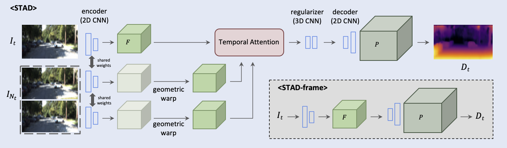
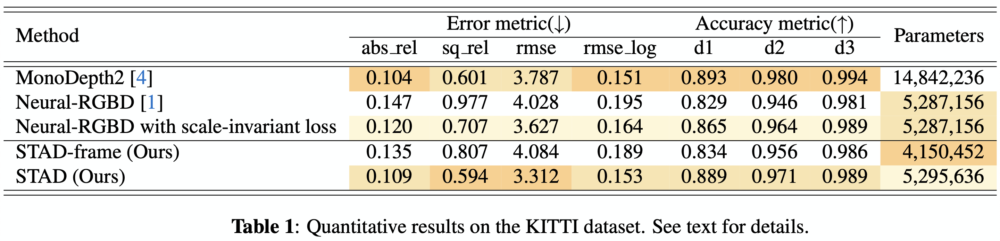

# STAD: Stable Video Depth Estimation (ICIP 2021)




## Getting Started 
This code has been developed under Anaconda(Python 3.6), Pytorch 1.6.0, Torchvision 0.7.0 and CUDA 10.1. 


1. Please install following environments:
    ```
    # create a new environment if needed
    conda create --name stad
    conda activate stad
    
    # install the the dependencies 
    pip install -r requirements.txt
    ```

2. Download KITTI data

    (1) Download raw data
    - Option1. Follow the instruction from [BTS github](https://github.com/cogaplex-bts/bts/tree/master/pytorch#kitti) 
    - Option2. Download the raw dataset from [KITTI dataset page](http://www.cvlibs.net/datasets/kitti/raw_data.php)
    
    (2) Download ground truth data
    - Download official ground truth from [KITTI dataset page](http://www.cvlibs.net/download.php?file=data_depth_annotated.zip)

3. Download pretrained weights 
    * From [google drive](https://drive.google.com/drive/folders/1H5Y2ELoQY4cHwzVxbm49pps7Wb0_RpWM?usp=sharing)
    

## Train on KITTI
In the code folder, run
```
sh local_train_kitti.sh
``` 

You need to change `dataset_path`, `exp_name` and `loss_type` correctly.

Please set parameters as follows:

| Models         | exp_name| loss_type|
| :------------: | :---: | :---: |
| [Neural-RGBD](https://github.com/NVlabs/neuralrgbd) | ver0-nrgbd | NLL |
| Neural-RGBD with scale-invariant loss | ver0-nrgbd_silog | silog |
| STAD-frame (Ours) | ver1-per_frame_silog | silog |
| STAD (Ours) | ver4-aggr_silog | silog |



## Test on KITTI with given camera pose
In this case we assume the camera poses are given with the dataset. 

In the code folder, run
```
sh local_test.sh
```
You need to change `dataset_path` and `model_path` correctly.

## Contact
If you have any questions, please contact the author [Hyunmin Lee&lt;hyunmin057@postech.ac.kr>](mailto:hyunmin057@postech.ac.kr).

## Acknowledgement
Portions of the source code (e.g., training pipeline, argument parser, and logger) are from NVIDIA, [Neural-RGBD](https://github.com/NVlabs/neuralrgbd)